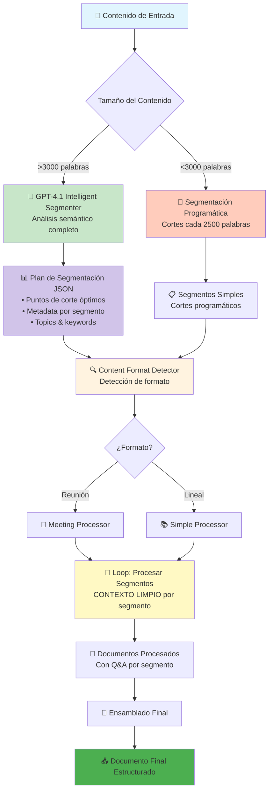
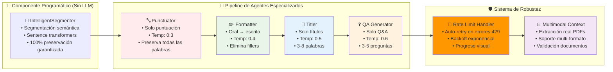

# 🚀 Sistema Multi-Agente de Procesamiento de Transcripciones

**Sistema LLM-agnóstico que transforma transcripciones STT en documentos educativos con Q&A automático**

> 📦 **Usa [UV](https://docs.astral.sh/uv/)** - Gestor de paquetes Python moderno. Instalar: `curl -LsSf https://astral.sh/uv/install.sh | sh`

## 🎯 ¿Qué hace?

Procesa transcripciones de audio (Speech-to-Text) y las convierte en documentos educativos estructurados con:
- ✅ Puntuación y formato profesional
- ✅ Títulos y secciones organizadas
- ✅ Preguntas y respuestas automáticas
- ✅ Soporte para reuniones y contenido lineal

## 🚀 Inicio Rápido

### 1. Instalar dependencias
```bash
uv sync
```

### 2. Configurar proveedor LLM
Edita `fastagent.config.yaml` con tu API key:

```yaml
# Azure OpenAI (recomendado)
azure:
  api_key: "tu-api-key"
  base_url: "https://tu-recurso.cognitiveservices.azure.com/"
  azure_deployment: "gpt-4.1"
  api_version: "2025-01-01-preview"

# O usa Ollama local
generic:
  api_key: "ollama"
  base_url: "http://localhost:11434/v1"
```

### 3. Ejecutar la interfaz web
```bash
uv run streamlit run streamlit_app/streamlit_app.py
```

Abre http://localhost:8501 en tu navegador.

## 🏗️ Arquitectura del Sistema

### **Pipeline con Segmentación Inteligente GPT-4.1**



**Ventajas de la Segmentación Inteligente:**
- ✅ GPT-4.1 analiza hasta 1M tokens de contexto (24k palabras = 3% del límite)
- ✅ Cortes en transiciones naturales de tema, no arbitrarios
- ✅ Metadata enriquecida para mejor procesamiento
- ✅ Contexto limpio por segmento (sin memoria entre segmentos)
- ✅ ~10 segmentos óptimos vs 30 arbitrarios para 24k palabras

### **Arquitectura Multi-Agente Especializada**



## 🖥️ Interfaz Web

### Páginas disponibles:
- **🏠 Inicio**: Procesamiento rápido de transcripciones
- **⚙️ Configuración**: Gestión de proveedores LLM (Básica/Avanzada/Experto)

### Flujo de uso:
1. **Configurar** proveedor LLM en la página de Configuración
2. **Pegar/subir** transcripción en la página de Inicio
3. **Procesar** con visualización en tiempo real
4. **Descargar** resultados en Markdown

## 🧠 Segmentación Inteligente con GPT-4.1

### **Método Automático vs Programático**

El sistema ofrece dos métodos de segmentación seleccionables desde la UI:

#### 🧠 Segmentación Inteligente (Recomendado para >3000 palabras)
- **Análisis completo**: GPT-4.1 analiza todo el contenido (hasta 1M tokens)
- **Cortes semánticos**: Identifica transiciones naturales de tema
- **Metadata enriquecida**: Genera título, keywords y conceptos clave por segmento
- **Resultado**: Plan JSON con puntos de corte óptimos

**Ejemplo para 24,000 palabras:**
- ✅ ~10 segmentos coherentes (vs 30 arbitrarios)
- ✅ Cada segmento es una unidad lógica completa
- ✅ Costo: ~$0.10 adicional por análisis inicial

#### 📐 Segmentación Programática (Rápido para <3000 palabras)
- División cada 2500 palabras buscando límites de oraciones
- Sin costo adicional de análisis
- Recomendado para contenido corto donde la velocidad es prioritaria

### **Contexto Limpio por Segmento**

**Clave del diseño:** Cada segmento se procesa con `async with agent.run()`, creando una **nueva sesión** sin memoria del segmento anterior.

```python
for segment in segments:
    async with agent.run() as agent_instance:  # 👈 Nueva sesión = contexto limpio
        result = await agent_instance.process(segment)
```

Esto garantiza:
- ✅ No hay "arrastre" de contexto entre segmentos
- ✅ Cada segmento se evalúa independientemente
- ✅ Procesamiento más consistente y predecible

## 🤖 Agentes Especializados

El sistema usa múltiples agentes especializados:

1. **Intelligent Segmenter** (GPT-4.1) - Análisis semántico y plan de segmentación
2. **Punctuator** (temp=0.3) - Añade puntuación y capitalización
3. **Formatter** (temp=0.4) - Estructura el contenido en secciones
4. **Titler** (temp=0.5) - Genera títulos descriptivos
5. **QA Generator** (temp=0.6) - Crea preguntas y respuestas educativas

## 📂 Formatos Soportados

- **Archivos de texto** (.txt)
- **Documentos** (.md, .pdf, .docx)
- **Transcripciones STT** (cualquier formato de texto)
- **Reuniones diarizadas** (detección automática)

## ⚙️ Configuración

### Proveedores LLM soportados:
- **Azure OpenAI** (recomendado para español)
- **Ollama** (local, gratuito)
- **OpenAI** (GPT-4, o1-mini)
- **Anthropic** (Claude)

### Rate Limiting inteligente:
El sistema incluye **prevención proactiva** de errores 429:
- **Delay entre segmentos**: Espera configurable entre requests (evita saturar API)
- **Reintentos automáticos**: Backoff exponencial en caso de error 429
- **Configuración flexible**: Ajustable desde UI con presets (Conservador/Balanceado/Agresivo)

```yaml
rate_limiting:
  requests_per_minute: 3
  delay_between_requests: 30      # Prevención proactiva (delay entre segmentos)
  max_retries: 3                  # Reintentos en caso de 429
  retry_base_delay: 60            # Delay inicial (backoff exponencial)
  max_tokens_per_request: 50000
```

## 🛠️ Scripts Disponibles

```bash
# Interfaz web principal
fastagent-ui

# Procesamiento por línea de comandos
uv run python scripts/cli.py --input archivo.txt --output resultado.md
```

## 🧪 Testing

```bash
# Ejecutar todos los tests
uv run pytest tests/ -v

# Test de integración Streamlit
uv run python tests/integration/test_streamlit_integration.py
```

## 📊 Características Técnicas

- **LLM-agnóstico**: Funciona con cualquier proveedor
- **Segmentación inteligente**: Divide contenido largo automáticamente (GPT-4.1 o programático)
- **Preservación de contenido**: 85-95% del contenido original conservado
- **Auto-detección**: Distingue reuniones de contenido lineal
- **Multimodal**: Soporte para imágenes en contexto
- **Escalable**: Maneja desde 200 a 22,000+ palabras
- **Rate limiting inteligente**: Prevención proactiva de errores 429 con delays configurables

## 🔧 Solución de Problemas

### Error "Azure OpenAI no está configurado"
- Verificar API key en `fastagent.config.yaml`
- Comprobar que la URL base sea correcta

### Errores 429 (Rate Limit)
El sistema ahora incluye **prevención automática**, pero si aún así ocurren:
1. **Aumentar `delay_between_requests`** en ⚙️ Configuración → Rate Limiting
   - Para S0 Tier: usar preset 🐌 Conservador (45s delay)
2. **Ajustar `max_retries`** y `retry_base_delay`
   - Más reintentos = más tolerancia a errores
3. **Revisar métricas** después de procesar
   - Si "Reintentos por rate limit" > 3, aumentar delays
4. Ver `docs/history/RATE_LIMIT_IMPROVEMENTS.md` para configuración detallada por tier

### Problemas de dependencias
```bash
uv sync --reinstall
```

## 📚 Documentación

- [Guía de Inicio Rápido](docs/QUICKSTART.md)
- [Configuración Detallada](docs/CONFIGURATION.md)
- [Funciones Avanzadas](docs/ADVANCED.md)