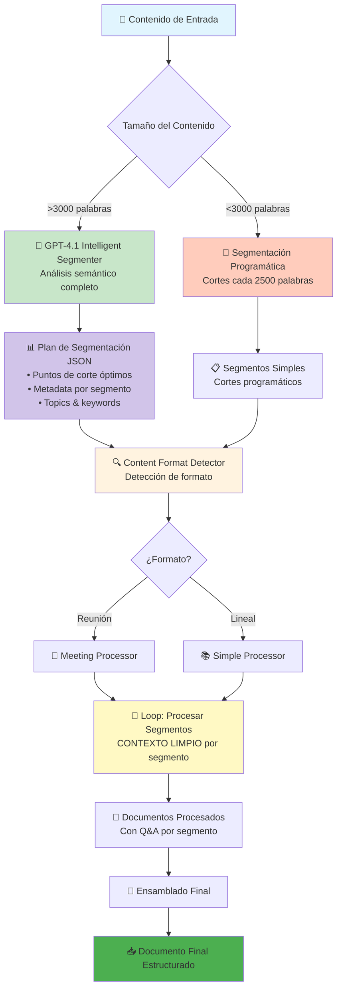
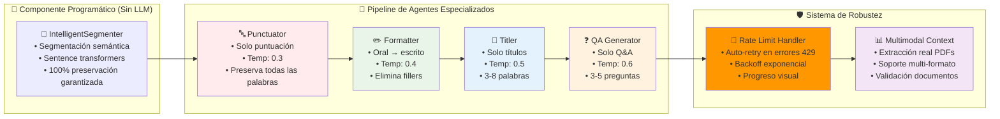

# 🚀 Sistema Multi-Agente de Procesamiento de Transcripciones

**Sistema LLM-agnóstico que transforma transcripciones STT en documentos educativos con Q&A automático**

> 📦 **Usa [UV](https://docs.astral.sh/uv/)** - Gestor de paquetes Python moderno. Instalar: `curl -LsSf https://astral.sh/uv/install.sh | sh`

## 🎯 ¿Qué hace?

Procesa transcripciones de audio (Speech-to-Text) y las convierte en documentos educativos estructurados con:
- ✅ Puntuación y formato profesional
- ✅ Títulos y secciones organizadas
- ✅ Preguntas y respuestas automáticas
- ✅ Soporte para reuniones y contenido lineal

## 🚀 Inicio Rápido

### 1. Instalar dependencias
```bash
uv sync
```

### 2. Configurar proveedor LLM
Edita `fastagent.config.yaml` con tu API key:

```yaml
# Azure OpenAI (recomendado)
azure:
  api_key: "tu-api-key"
  base_url: "https://tu-recurso.cognitiveservices.azure.com/"
  azure_deployment: "gpt-4.1"
  api_version: "2025-01-01-preview"

# O usa Ollama local
generic:
  api_key: "ollama"
  base_url: "http://localhost:11434/v1"
```

### 3A. Usar desde línea de comandos (CLI)
```bash
# Procesamiento básico
fastagent-cli -i transcription.txt -o output.md

# Con configuración avanzada
fastagent-cli -i input.txt -o output.md --preset conservative --segmentation intelligent
```

### 3B. Ejecutar la interfaz web
```bash
uv run streamlit run streamlit_app/streamlit_app.py
```

Abre http://localhost:8501 en tu navegador.

## 🏗️ Arquitectura del Sistema

### **Pipeline con Segmentación Inteligente GPT-4.1**



**Ventajas de la Segmentación Inteligente:**
- ✅ GPT-4.1 analiza hasta 1M tokens de contexto (24k palabras = 3% del límite)
- ✅ Cortes en transiciones naturales de tema, no arbitrarios
- ✅ Metadata enriquecida para mejor procesamiento
- ✅ Contexto limpio por segmento (sin memoria entre segmentos)
- ✅ ~10 segmentos óptimos vs 30 arbitrarios para 24k palabras

### **Arquitectura Multi-Agente Especializada**



## 🖥️ Interfaz Web

### Páginas disponibles:
- **🏠 Dashboard**: Estado del sistema y acceso rápido
- **⚙️ Configuración**: Gestión de proveedores LLM (Azure, Ollama, OpenAI, Anthropic)
- **📝 Procesamiento**: Upload y procesamiento de archivos con progreso visual
- **🤖 Agentes**: Gestión de prompts, testing y configuración avanzada

### Flujo de uso:
1. **Configurar** proveedor LLM en la página de Configuración
2. **Subir** transcripción en la página de Procesamiento
3. **Procesar** con visualización en tiempo real
4. **Descargar** resultados en TXT o MD

## 🧠 Segmentación Inteligente con GPT-4.1

### **Método Automático vs Programático**

El sistema ofrece dos métodos de segmentación seleccionables desde la UI:

#### 🧠 Segmentación Inteligente (Recomendado para >3000 palabras)
- **Análisis completo**: GPT-4.1 analiza todo el contenido (hasta 1M tokens)
- **Cortes semánticos**: Identifica transiciones naturales de tema
- **Metadata enriquecida**: Genera título, keywords y conceptos clave por segmento
- **Resultado**: Plan JSON con puntos de corte óptimos

**Ejemplo para 24,000 palabras:**
- ✅ ~10 segmentos coherentes (vs 30 arbitrarios)
- ✅ Cada segmento es una unidad lógica completa
- ✅ Costo: ~$0.10 adicional por análisis inicial

#### 📐 Segmentación Programática (Rápido para <3000 palabras)
- División cada 2500 palabras buscando límites de oraciones
- Sin costo adicional de análisis
- Recomendado para contenido corto donde la velocidad es prioritaria

### **Contexto Limpio por Segmento**

**Clave del diseño:** Cada segmento se procesa con `async with agent.run()`, creando una **nueva sesión** sin memoria del segmento anterior.

```python
for segment in segments:
    async with agent.run() as agent_instance:  # 👈 Nueva sesión = contexto limpio
        result = await agent_instance.process(segment)
```

Esto garantiza:
- ✅ No hay "arrastre" de contexto entre segmentos
- ✅ Cada segmento se evalúa independientemente
- ✅ Procesamiento más consistente y predecible

## 🤖 Agentes Especializados

El sistema usa múltiples agentes especializados:

1. **Intelligent Segmenter** (GPT-4.1) - Análisis semántico y plan de segmentación
2. **Punctuator** (temp=0.3) - Añade puntuación y capitalización
3. **Formatter** (temp=0.4) - Estructura el contenido en secciones
4. **Titler** (temp=0.5) - Genera títulos descriptivos
5. **QA Generator** (temp=0.6) - Crea preguntas y respuestas educativas

## 📂 Formatos Soportados

- **Archivos de texto** (.txt)
- **Documentos** (.md, .pdf, .docx)
- **Transcripciones STT** (cualquier formato de texto)
- **Reuniones diarizadas** (detección automática)

## ⚙️ Configuración

### Proveedores LLM soportados:
- **Azure OpenAI** (recomendado para español)
- **Ollama** (local, gratuito)
- **OpenAI** (GPT-4, o1-mini)
- **Anthropic** (Claude)

### Rate Limiting inteligente:
El sistema incluye **prevención proactiva** de errores 429:
- **Delay entre segmentos**: Espera configurable entre requests (evita saturar API)
- **Reintentos automáticos**: Backoff exponencial en caso de error 429
- **Configuración flexible**: Ajustable desde UI con presets (Conservador/Balanceado/Agresivo)

```yaml
rate_limiting:
  requests_per_minute: 3
  delay_between_requests: 30      # Prevención proactiva (delay entre segmentos)
  max_retries: 3                  # Reintentos en caso de 429
  retry_base_delay: 60            # Delay inicial (backoff exponencial)
  max_tokens_per_request: 50000
```

## 🛠️ Scripts Disponibles

```bash
# CLI de procesamiento (nuevo)
fastagent-cli -i input.txt -o output.md

# Interfaz web principal
fastagent-ui

# Dashboard alternativo
fastagent-dashboard

# Script legacy de procesamiento
uv run python robust_main.py --input archivo.txt --output resultado.md
```

---

## 💻 Uso del CLI (Command-Line Interface)

### **Instalación y Configuración**

```bash
# 1. Instalar dependencias
uv sync

# 2. Copiar plantilla de variables de entorno
cp .env.example .env

# 3. Editar .env con tus credenciales
nano .env

# 4. Verificar instalación
fastagent-cli --version
```

### **Ejemplos de Uso**

#### **Básico**
```bash
# Procesamiento simple
fastagent-cli -i transcription.txt -o output.md
```

#### **Con Documentos Adicionales (Multimodal)**
```bash
# Incluir PDFs, imágenes u otros documentos para contexto
fastagent-cli -i input.txt -o output.md -d slides.pdf notes.txt diagram.png
```

#### **Usando Presets de Configuración**
```bash
# Para ambientes con rate limiting estricto (Azure S0)
fastagent-cli -i input.txt -o output.md --preset conservative

# Balance entre velocidad y calidad
fastagent-cli -i input.txt -o output.md --preset balanced

# Máxima calidad con segmentación AI
fastagent-cli -i input.txt -o output.md --preset intelligent

# Máxima velocidad
fastagent-cli -i input.txt -o output.md --preset fast
```

#### **Configuración Avanzada**
```bash
# Segmentación inteligente con GPT-4.1
fastagent-cli -i input.txt -o output.md --segmentation intelligent

# Agente específico para reuniones
fastagent-cli -i meeting.txt -o output.md --agent meeting_processor

# Control manual de rate limiting
fastagent-cli -i input.txt -o output.md \
  --delay 45 \
  --max-retries 5 \
  --retry-delay 90

# Sin Q&A (más rápido)
fastagent-cli -i input.txt -o output.md --no-qa

# Modo verbose para debugging
fastagent-cli -i input.txt -o output.md -v

# Simular sin hacer llamadas LLM
fastagent-cli -i input.txt -o output.md --dry-run
```

#### **Usando Variables de Entorno**
```bash
# Configurar variables de entorno
export FASTAGENT_MODEL=azure.gpt-4.1
export FASTAGENT_DELAY=45
export FASTAGENT_PROVIDER=azure

# Ejecutar sin argumentos adicionales
fastagent-cli -i input.txt -o output.md
```

### **Opciones Disponibles**

#### **Argumentos Requeridos**
```
-i, --input          Archivo de entrada (TXT, MD, PDF, DOCX)
-o, --output         Archivo de salida (MD, TXT)
```

#### **Input/Output**
```
-d, --documents      Documentos adicionales para contexto multimodal
--output-format      Formato de salida (md, txt) [default: md]
```

#### **Modelo y Proveedor**
```
--model              Modelo a usar (azure.gpt-4.1, generic.llama3.1, etc.)
--provider           Proveedor LLM (azure, ollama, openai, anthropic)
--config             Archivo de configuración [default: fastagent.config.yaml]
```

#### **Procesamiento**
```
--agent              Agente a usar (auto, simple_processor, meeting_processor)
--segmentation       Método de segmentación (intelligent, programmatic, auto)
--enable-qa          Habilitar generación de Q&A [default: enabled]
--no-qa              Deshabilitar generación de Q&A
--qa-questions       Número de preguntas por segmento [default: 4]
```

#### **Rate Limiting**
```
--preset             Preset de configuración (fast, balanced, conservative, intelligent)
--delay              Delay entre requests en segundos
--max-retries        Máximo de reintentos en error 429
--retry-delay        Delay base para reintentos (backoff exponencial)
```

#### **General**
```
-v, --verbose        Logging detallado
--no-progress        Desactivar barra de progreso
--dry-run            Simular procesamiento sin LLM calls
--version            Mostrar versión
```

### **Presets Explicados**

| Preset | Segmentación | Q&A | Delay | Retries | Uso Recomendado |
|--------|-------------|-----|-------|---------|-----------------|
| **fast** | Programática | No | 10s | 2 | Procesamiento rápido, sin Q&A |
| **balanced** | Auto | Sí (3) | 20s | 3 | Balance velocidad/calidad (default) |
| **conservative** | Programática | Sí (4) | 45s | 5 | Azure S0 tier, rate limiting estricto |
| **intelligent** | AI (GPT-4.1) | Sí (5) | 30s | 3 | Máxima calidad, contenido >3000 palabras |

### **Variables de Entorno**

Crea un archivo `.env` basado en `.env.example`:

```bash
# General
FASTAGENT_PROVIDER=azure
FASTAGENT_MODEL=azure.gpt-4.1
FASTAGENT_OUTPUT_DIR=./output

# Rate Limiting
FASTAGENT_DELAY=30
FASTAGENT_MAX_RETRIES=3
FASTAGENT_RETRY_DELAY=60

# Azure OpenAI
AZURE_API_KEY=your-key
AZURE_BASE_URL=https://your-resource.cognitiveservices.azure.com/
AZURE_DEPLOYMENT=gpt-4.1
AZURE_API_VERSION=2025-01-01-preview

# Ollama
OLLAMA_BASE_URL=http://localhost:11434/v1

# OpenAI
OPENAI_API_KEY=your-key

# Anthropic
ANTHROPIC_API_KEY=your-key
```

### **Salida del CLI**

El CLI muestra:

1. **Resumen de configuración** antes de procesar
2. **Barra de progreso** durante procesamiento
3. **Estadísticas finales** al completar:
   - Tiempo de procesamiento
   - Segmentos procesados
   - Método de segmentación usado
   - Tasa de retención de contenido
   - Reintentos por rate limiting

**Ejemplo de salida:**

```
============================================================
CONFIGURATION SUMMARY
============================================================
Input:              transcription.txt
Output:             output.md
Model:              azure.gpt-4.1
Agent:              auto
Segmentation:       intelligent
Q&A Generation:     Enabled
  Questions/segment: 4

Rate Limiting:
  Delay:            30s between requests
  Max retries:      3
  Retry delay:      60s base
============================================================

📊 Estimated processing time: ~5 minutes
📝 Content size: 5,432 words

[████████████████████████████████████████] 100% - ¡Procesamiento completado!

============================================================
PROCESSING COMPLETED SUCCESSFULLY
============================================================

⏱️  Processing Time: 312.5 seconds
📁 Output File: output.md

📊 Statistics:
   Agent used:       simple_processor
   Segmentation:     intelligent_ai
   Total segments:   4
   Retry count:      0

📝 Content:
   Original words:   5,432
   Final words:      5,891
   Retention rate:   108.4%

============================================================
```

### **Troubleshooting CLI**

#### **Error: Command not found: fastagent-cli**
```bash
# Reinstalar
uv sync

# O ejecutar directamente
uv run python fastagent_cli.py -i input.txt -o output.md
```

#### **Error: Input file not found**
Verifica que la ruta sea correcta y que el archivo exista.

#### **Error: No LLM provider configured**
```bash
# Verificar configuración
cat fastagent.config.yaml

# O usar variables de entorno
export FASTAGENT_MODEL=azure.gpt-4.1
export AZURE_API_KEY=your-key
```

#### **Muchos reintentos por rate limiting**
```bash
# Aumentar delay
fastagent-cli -i input.txt -o output.md --delay 60

# O usar preset conservador
fastagent-cli -i input.txt -o output.md --preset conservative
```

---

## 🧪 Testing

```bash
# Ejecutar todos los tests
uv run pytest tests/ -v

# Test específico de Streamlit
uv run python test_streamlit_integration.py
```

## 📊 Características Técnicas

- **LLM-agnóstico**: Funciona con cualquier proveedor
- **Segmentación inteligente**: Divide contenido largo automáticamente (GPT-4.1 o programático)
- **Preservación de contenido**: 85-95% del contenido original conservado
- **Auto-detección**: Distingue reuniones de contenido lineal
- **Multimodal**: Soporte para imágenes en contexto
- **Escalable**: Maneja desde 200 a 22,000+ palabras
- **Rate limiting inteligente**: Prevención proactiva de errores 429 con delays configurables

## 🔧 Solución de Problemas

### Error "Azure OpenAI no está configurado"
- Verificar API key en `fastagent.config.yaml`
- Comprobar que la URL base sea correcta

### Errores 429 (Rate Limit)
El sistema ahora incluye **prevención automática**, pero si aún así ocurren:
1. **Aumentar `delay_between_requests`** en ⚙️ Configuración → Rate Limiting
   - Para S0 Tier: usar preset 🐌 Conservador (45s delay)
2. **Ajustar `max_retries`** y `retry_base_delay`
   - Más reintentos = más tolerancia a errores
3. **Revisar métricas** después de procesar
   - Si "Reintentos por rate limit" > 3, aumentar delays
4. Ver `RATE_LIMIT_IMPROVEMENTS.md` para configuración detallada por tier

### Problemas de dependencias
```bash
uv sync --reinstall
```