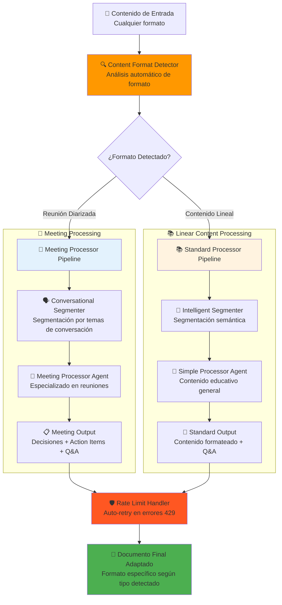
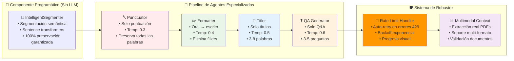

# 🚀 Sistema Multi-Agente de Procesamiento de Transcripciones

**Sistema LLM-agnóstico que transforma transcripciones STT en documentos educativos con Q&A automático**

> 📦 **Usa [UV](https://docs.astral.sh/uv/)** - Gestor de paquetes Python moderno. Instalar: `curl -LsSf https://astral.sh/uv/install.sh | sh`

## 🎯 ¿Qué hace?

Procesa transcripciones de audio (Speech-to-Text) y las convierte en documentos educativos estructurados con:
- ✅ Puntuación y formato profesional
- ✅ Títulos y secciones organizadas
- ✅ Preguntas y respuestas automáticas
- ✅ Soporte para reuniones y contenido lineal

## 🚀 Inicio Rápido

### 1. Instalar dependencias
```bash
uv sync
```

### 2. Configurar proveedor LLM
Edita `fastagent.config.yaml` con tu API key:

```yaml
# Azure OpenAI (recomendado)
azure:
  api_key: "tu-api-key"
  base_url: "https://tu-recurso.cognitiveservices.azure.com/"
  azure_deployment: "gpt-4.1"
  api_version: "2025-01-01-preview"

# O usa Ollama local
generic:
  api_key: "ollama"
  base_url: "http://localhost:11434/v1"
```

### 3. Ejecutar la interfaz web
```bash
uv run streamlit run streamlit_app/streamlit_app.py
```

Abre http://localhost:8501 en tu navegador.

## 🏗️ Arquitectura del Sistema

### **Pipeline Adaptativo de Procesamiento (Auto-Detección de Formato)**



### **Arquitectura Multi-Agente Especializada**



## 🖥️ Interfaz Web

### Páginas disponibles:
- **🏠 Dashboard**: Estado del sistema y acceso rápido
- **⚙️ Configuración**: Gestión de proveedores LLM (Azure, Ollama, OpenAI, Anthropic)
- **📝 Procesamiento**: Upload y procesamiento de archivos con progreso visual
- **🤖 Agentes**: Gestión de prompts, testing y configuración avanzada

### Flujo de uso:
1. **Configurar** proveedor LLM en la página de Configuración
2. **Subir** transcripción en la página de Procesamiento
3. **Procesar** con visualización en tiempo real
4. **Descargar** resultados en TXT o MD

## 🤖 Agentes Especializados

El sistema usa 4 agentes en cadena con temperaturas específicas:

1. **Punctuator** (temp=0.3) - Añade puntuación y capitalización
2. **Formatter** (temp=0.4) - Estructura el contenido en secciones
3. **Titler** (temp=0.5) - Genera títulos descriptivos
4. **QA Generator** (temp=0.6) - Crea preguntas y respuestas educativas

## 📂 Formatos Soportados

- **Archivos de texto** (.txt)
- **Documentos** (.md, .pdf, .docx)
- **Transcripciones STT** (cualquier formato de texto)
- **Reuniones diarizadas** (detección automática)

## ⚙️ Configuración

### Proveedores LLM soportados:
- **Azure OpenAI** (recomendado para español)
- **Ollama** (local, gratuito)
- **OpenAI** (GPT-4, o1-mini)
- **Anthropic** (Claude)

### Rate Limiting automático:
```yaml
rate_limiting:
  requests_per_minute: 3
  delay_between_requests: 30
  max_tokens_per_request: 50000
```

## 🛠️ Scripts Disponibles

```bash
# Interfaz web principal
fastagent-ui

# Dashboard alternativo
fastagent-dashboard

# Procesamiento por línea de comandos
uv run python robust_main.py --input archivo.txt --output resultado.md
```

## 🧪 Testing

```bash
# Ejecutar todos los tests
uv run pytest tests/ -v

# Test específico de Streamlit
uv run python test_streamlit_integration.py
```

## 📊 Características Técnicas

- **LLM-agnóstico**: Funciona con cualquier proveedor
- **Segmentación inteligente**: Divide contenido largo automáticamente
- **Preservación de contenido**: 85-95% del contenido original conservado
- **Auto-detección**: Distingue reuniones de contenido lineal
- **Multimodal**: Soporte para imágenes en contexto
- **Escalable**: Maneja desde 200 a 22,000+ palabras

## 🔧 Solución de Problemas

### Error "Azure OpenAI no está configurado"
- Verificar API key en `fastagent.config.yaml`
- Comprobar que la URL base sea correcta

### Errores 429 (Rate Limit)
- Aumentar `delay_between_requests` en la configuración
- Reducir `requests_per_minute`

### Problemas de dependencias
```bash
uv sync --reinstall
```