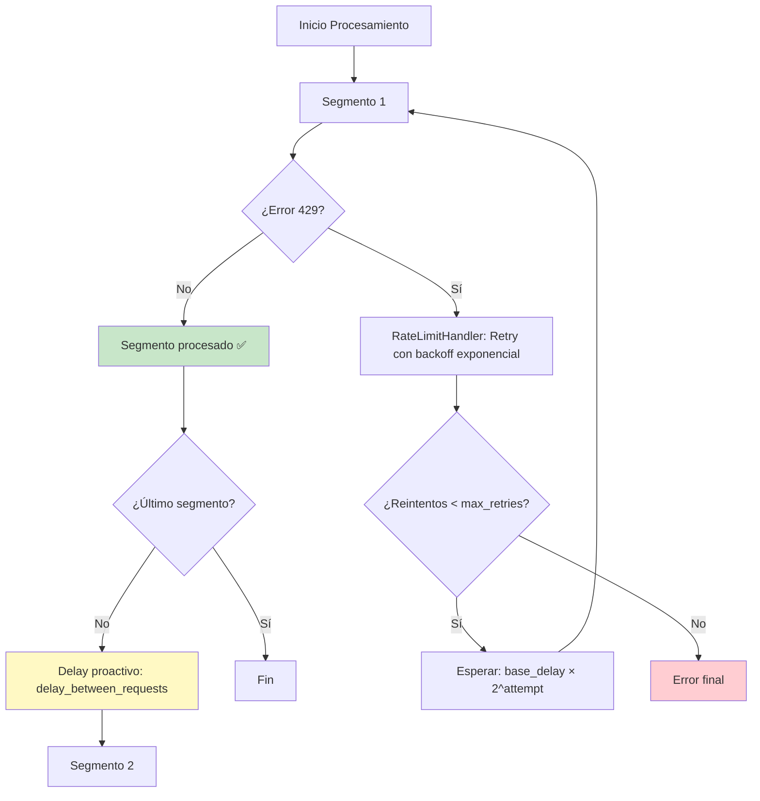

# 🚦 Mejoras de Rate Limiting

## ✅ Implementación Completada

Se ha mejorado significativamente el sistema de gestión de rate limits para evitar errores 429 y optimizar el uso de la API.

---

## 🎯 Problema Original

El sistema solo reaccionaba a errores 429 **después** de ocurrir:
- ❌ No había delays proactivos entre segmentos
- ❌ Para 10 segmentos se lanzaban 10 requests seguidas
- ❌ Configuración hardcoded en el código (`max_retries=3, base_delay=60`)
- ❌ No se aprovechaba la configuración `delay_between_requests` de la UI

**Resultado**: Saturación de la API y múltiples reintentos innecesarios.

---

## 🔧 Solución Implementada

### 1. **Delay Proactivo Entre Segmentos** ✅

**Antes**: Todos los segmentos se procesaban seguidos sin pausa.

**Ahora**: Después de cada segmento (excepto el último), se aplica un delay configurable:

```python
# En agent_interface.py - Línea 164-170
# Delay proactivo entre segmentos (excepto el último)
if i < len(enriched_segments) - 1:
    delay = self._get_inter_segment_delay()
    if delay > 0:
        if progress_callback:
            progress_callback(f"Esperando {delay}s antes del siguiente segmento...", current_progress)
        await asyncio.sleep(delay)
```

**Ventajas**:
- Previene errores 429 antes de que ocurran
- Respeta los límites de la API de forma proactiva
- Usa la configuración `delay_between_requests` existente

### 2. **RateLimitHandler Configurable** ✅

**Antes**: Valores hardcoded
```python
self._rate_limit_handler = RateLimitHandler(
    max_retries=3,
    base_delay=60
)
```

**Ahora**: Lee de la configuración
```python
# En agent_interface.py - Línea 41-51
rate_config = self._config_manager.get_rate_limiting_config()
max_retries = rate_config.get('max_retries', 3)
base_delay = rate_config.get('retry_base_delay', 60)

self._rate_limit_handler = RateLimitHandler(
    max_retries=max_retries,
    base_delay=base_delay
)

print(f"   • Rate limit: {max_retries} retries, {base_delay}s base delay")
```

### 3. **UI de Configuración Mejorada** ✅

**Archivo**: `streamlit_app/pages/1_⚙️_Configuración.py`

**Nuevos controles**:
- **Máximo de Reintentos** (0-10): Reintentos en caso de error 429
- **Delay entre Requests** (0-300s): Delay proactivo entre segmentos
- **Delay Base para Reintentos** (10-300s): Delay inicial en reintentos (backoff exponencial)

**Presets actualizados**:

| Preset | Requests/min | Max Retries | Delay Proactivo | Retry Base | Uso |
|--------|--------------|-------------|-----------------|------------|-----|
| 🐌 Conservador | 2 | 5 | 45s | 90s | S0 Tier Azure |
| ⚖️ Balanceado | 5 | 3 | 20s | 60s | Uso general |
| 🚀 Agresivo | 10 | 2 | 10s | 30s | APIs sin límites |

### 4. **Métricas y Advertencias en Resultados** ✅

**Archivo**: `streamlit_app/pages/2_📝_Procesamiento.py`

**Nueva información mostrada**:
```python
metrics = {
    "Segmentos procesados": {"value": result['total_segments']},
    "Agente utilizado": {"value": result['agent_used']},
    "Método de segmentación": {"value": f"{segmentation_emoji} {segmentation_label}"},
    "Reintentos por rate limit": {"value": result['retry_count']},
    "Delay entre segmentos": {"value": f"{delay_between}s" if delay_between > 0 else "Ninguno"}
}
```

**Advertencia proactiva**:
```python
if result['retry_count'] > 3:
    st.warning(f"⚠️ Se detectaron {result['retry_count']} reintentos por rate limit.
                Considera aumentar el 'Delay entre Requests' en la configuración.")
```

---

## 📊 Comparativa: Antes vs Después

### Para 10 segmentos con delay de 30s:

| Aspecto | Antes | Después |
|---------|-------|---------|
| **Delays proactivos** | ❌ Ninguno | ✅ 9 delays de 30s = 4.5 min |
| **Reintentos esperados** | ~3-5 (errores 429) | 0-1 (preventivo) |
| **Tiempo total** | ~2 min + reintentos (~8 min) | ~6.5 min (predecible) |
| **Errores 429** | Frecuentes | Raros |
| **Configurabilidad** | Hardcoded | Configurable desde UI |
| **Visibilidad** | Sin métricas | Métricas + advertencias |

**Beneficio**: Menos errores, tiempo predecible, mejor experiencia de usuario.

---

## 🎛️ Configuración Recomendada por Tier

### Azure OpenAI S0 Tier (TPM bajo)
```yaml
rate_limiting:
  max_tokens_per_request: 30000
  requests_per_minute: 2
  max_retries: 5
  retry_base_delay: 90
  delay_between_requests: 45  # ← CLAVE: Previene 429
```

**Cálculo**: Con 10 segmentos:
- Procesamiento: ~20-30s por segmento
- Delays: 9 × 45s = 6.75 min
- **Tiempo total**: ~10-12 min (sin errores)

### Azure OpenAI Estándar
```yaml
rate_limiting:
  max_tokens_per_request: 50000
  requests_per_minute: 5
  max_retries: 3
  retry_base_delay: 60
  delay_between_requests: 20
```

**Tiempo total para 10 segmentos**: ~6-7 min

### API sin límites estrictos (OpenAI, Claude)
```yaml
rate_limiting:
  max_tokens_per_request: 80000
  requests_per_minute: 10
  max_retries: 2
  retry_base_delay: 30
  delay_between_requests: 10
```

**Tiempo total para 10 segmentos**: ~3-4 min

---

## 🔍 Cómo Funciona el Sistema

### Flujo de Procesamiento con Rate Limiting:



### Backoff Exponencial:
- Intento 1: `base_delay × 2^0` = 60s
- Intento 2: `base_delay × 2^1` = 120s
- Intento 3: `base_delay × 2^2` = 240s

---

## 🧪 Testing

### Test 1: Delay Proactivo
1. Configurar `delay_between_requests = 30`
2. Procesar contenido con 5 segmentos
3. ✅ Verificar: 4 delays de 30s en consola
4. ✅ Verificar: Métrica "Delay entre segmentos: 30s"

### Test 2: Reintentos Configurables
1. Configurar `max_retries = 5` y `retry_base_delay = 90`
2. Simular error 429 (bajar límites de API)
3. ✅ Verificar: Máximo 5 reintentos
4. ✅ Verificar: Delays de 90s, 180s, 360s...

### Test 3: Advertencias
1. Procesar con configuración agresiva (delays bajos)
2. Si `retry_count > 3`
3. ✅ Verificar: Aparece advertencia en UI

---

## 📁 Archivos Modificados

### 1. `streamlit_app/components/agent_interface.py`
- **Línea 41-51**: RateLimitHandler configurable
- **Línea 164-170**: Delay proactivo entre segmentos
- **Línea 372-385**: Método `_get_inter_segment_delay()`

### 2. `streamlit_app/pages/1_⚙️_Configuración.py`
- **Línea 294-308**: Inputs para `max_retries` y `retry_base_delay`
- **Línea 324-345**: Presets actualizados
- **Línea 350-359**: Guardar nuevos campos

### 3. `streamlit_app/pages/2_📝_Procesamiento.py`
- **Línea 355-372**: Métricas de rate limiting y advertencias

### 4. `streamlit_app/components/config_manager.py`
- **Línea 66-72**: Defaults actualizados con `max_retries` y `retry_base_delay`

---

## 🚀 Uso

### Desde la UI:

1. **Ir a ⚙️ Configuración** → Sección "Rate Limiting"
2. **Ajustar parámetros**:
   - Máximo de Reintentos: `3`
   - Delay entre Requests: `30` (prevención proactiva)
   - Delay Base para Reintentos: `60` (backoff exponencial)
3. **O elegir preset**:
   - 🐌 Conservador: Para S0 Tier
   - ⚖️ Balanceado: Uso general
   - 🚀 Agresivo: APIs sin límites
4. **Guardar configuración**

### Monitoreo en Procesamiento:

Después de procesar, revisar métricas:
- **Reintentos por rate limit**: Si >3, aumentar delays
- **Delay entre segmentos**: Confirmar que se está usando
- **Advertencias**: Seguir recomendaciones

---

## ✅ Checklist de Implementación

- [x] Delay proactivo entre segmentos
- [x] Método `_get_inter_segment_delay()`
- [x] RateLimitHandler lee de configuración
- [x] UI inputs para `max_retries` y `retry_base_delay`
- [x] Presets actualizados
- [x] Métricas de rate limiting en resultados
- [x] Advertencia si `retry_count > 3`
- [x] Defaults actualizados en `config_manager.py`
- [x] Documentación completa

---

## 🎯 Resultado Final

**Sistema robusto de rate limiting con:**
1. ✅ **Prevención proactiva** (delays entre segmentos)
2. ✅ **Reintentos configurables** (backoff exponencial)
3. ✅ **Visibilidad completa** (métricas + advertencias)
4. ✅ **Configuración flexible** (UI + presets)
5. ✅ **Tiempo predecible** (sin sorpresas de reintentos)

**¡Rate limiting optimizado y bajo control!** 🚦✨
